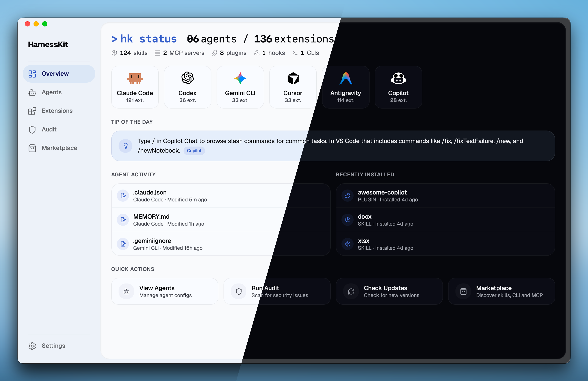
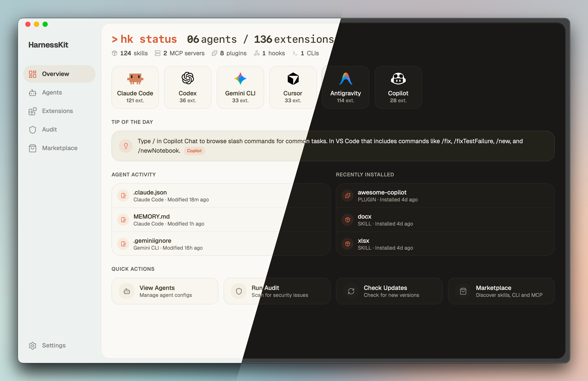

<p align="center">
  
</p>

<h1 align="center">HarnessKit</h1>

<p align="center">
  <strong>One home for every agent.</strong><br/>
  A free, open-source app to manage all your AI coding agents.
</p>

<p align="center">
  <a href="https://github.com/RealZST/HarnessKit/releases/latest"></a>
  <a href="LICENSE"></a>
  
</p>

<p align="center">
  <a href="#why-harnesskit">Why</a>&nbsp;&nbsp;&bull;&nbsp;&nbsp;<a href="#key-features">Features</a>&nbsp;&nbsp;&bull;&nbsp;&nbsp;<a href="#getting-started">Get Started</a>&nbsp;&nbsp;&bull;&nbsp;&nbsp;<a href="#roadmap">Roadmap</a>
</p>

<br/>

<p align="center">
  
</p>

<br/>

## Why HarnessKit?

Every agent, a different world. Extensions, configs, memory, and rules — scattered across different directories, in different formats, with different conventions.

**HarnessKit brings them all under one roof** — one native desktop app to see, secure, and manage everything across every agent.

<p align="center">
  
</p>

---

## Key Features

### 🧩 Full Suite Extension Management

HarnessKit manages **all five extension types** from a unified interface — **Skills**, **MCP Servers**, **Plugins**, **Hooks**, and **Agent-first CLIs**.

<div align="center">

| Agent | Skills | MCP | Plugins | Hooks | Agent-first CLIs |
|:---|:---:|:---:|:---:|:---:|:---:|
| **Claude Code** | ✓ | ✓ | ✓ | ✓ | ✓ |
| **Codex** | ✓ | ✓ | ✓ | ✓ | ✓ |
| **Gemini CLI** | ✓ | ✓ | ✓ | ✓ | ✓ |
| **Cursor** | ✓ | ✓ | ✓ | ✓ | ✓ |
| **Antigravity** | ✓ | ✓ | — | — | ✓ |
| **Copilot** | ✓ | ✓ | ✓ | ✓ | ✓ |

<small><i>* "—" indicates the agent currently does not support this extension type.</i></small>

</div>

- **Smart organization** — Filter by *type*, *agent*, or *source*, and search by name. Extensions from the same repo are automatically grouped into *packs* for batch management.
- **Full visibility** — Every extension shows its *agents*, *permissions*, *trust score*, and *status* at a glance. Open the detail panel for per-agent *file paths*, *directory structure*, and *audit findings*.
- **Effortless management** — Enable or disable right from the list. Check for updates across all extensions with one click.
- **Cross-agent deployment** — See which agents have the extension and which don't — deploy to any missing agent with one click. HarnessKit handles the format differences between agents (JSON, TOML, hook conventions, MCP schemas) automatically.

<p align="center">
  <video src="https://github.com/user-attachments/assets/897611c4-4ca3-426f-91ba-fcda301e9cfe" width="800" autoplay loop muted playsinline></video>
  <video src="https://github.com/user-attachments/assets/a2a74fd1-f3f2-4525-9d64-ba00378d6eef" width="800" autoplay loop muted playsinline></video>
</p>

---

### 🤖 Agent Configs, Memory & Rules

HarnessKit manages every agent's **Configs**, **Memory**, **Rules**, and **Ignore** files from one place. Currently supporting **6 agents**: **Claude Code**, **Codex**, **Gemini CLI**, **Cursor**, **Antigravity**, and **Copilot**.

- **Config file tracking** — Automatically discovers every agent's config files — both global and per-project. Add your project directories or custom paths and HarnessKit picks them up alongside the global ones.
- **Per-agent dashboard** — Each agent gets its own page with all files organized by category, showing scope, path, file size, and a summary of installed extensions. Expand any file to preview its content right in the app.
- **Custom paths** — Add any file or folder to an agent's dashboard for tracking. Useful for custom configs or scripts that HarnessKit doesn't auto-discover — they show up alongside everything else with the same live preview.
- **Real-time detection** — The moment a config file is modified, the dashboard reflects it.

<p align="center">
  <video src="https://github.com/user-attachments/assets/9b38494a-2ab3-4071-a450-02a30b859323" width="800" autoplay loop muted playsinline></video>
</p>

---

### 🛡️ Security Audit & Permission Transparency

Every extension is scanned by a built-in security engine with 18 static analysis rules and receives a **Trust Score** (0–100), grouped into three tiers — **Safe** (80+), **Low Risk** (60–79), and **Needs Review** (below 60). A dedicated Audit page lets you search, filter by tier, and drill into every finding.

- **One-click audit** — Run a full security scan across all extensions with a single click. The dashboard shows how many extensions were scanned and when the last audit ran.
- **Precise tracing** — Every finding pinpoints the exact file and line number, so you can trace the issue immediately.
- **Per-agent scanning** — Even if multiple agents share the same extension, each agent's copy is audited independently — because versions can drift, and a safe copy on one agent doesn't guarantee safety on another.
- **Permission transparency** — Every extension's permissions are surfaced across five dimensions — filesystem paths, network domains, shell commands, database engines, and environment variables. You see exactly what each extension can reach before you decide to keep it.

<p align="center">
  <video src="https://github.com/user-attachments/assets/5650c759-f30f-42df-83b2-cf0bafd3fb95" width="800" autoplay loop muted playsinline></video>
</p>

---

### 🏪 Marketplace Ecosystem

Discover, evaluate, and install — three marketplaces in one, each with trending lists and search:

- **Skills** — Browse and install from the [skills.sh](https://skills.sh) registry. Also supports install from **Git URL** or **local directory**.
- **MCP Servers** — Browse the [Smithery](https://smithery.ai) registry of Model Context Protocol servers.
- **Agent-first CLI** — Discover CLI tools built specifically for agents — the newest frontier of the agent extension ecosystem.

Every listing shows its description, install count, and source. For skills, you can preview the documentation, check third-party security audit scores before installing, and install to any agent with one click — HarnessKit tracks the source so you always know where each extension came from.

<p align="center">
  <video src="https://github.com/user-attachments/assets/a80e2c95-52fe-4cd5-aab1-bd01b4c224cf" width="800" autoplay loop muted playsinline></video>
</p>

---

### 📂 In-Place Management

HarnessKit works directly with your agents' native directories instead of copying them into a managed folder — no shadow copies, no sync conflicts.

- **Native directories** — Reads and writes directly to each agent's own config directory. Your files stay exactly where they are.
- **Non-destructive operations** — Enabling or disabling an extension is a simple file rename in place. Nothing is moved or duplicated.
- **Zero lock-in** — Uninstall HarnessKit and everything is exactly where it was. No migration, no cleanup needed.

---

### ⌨️ CLI Support

HarnessKit also ships a standalone command-line interface (`hk`) for terminal-first workflows, so you can manage extensions without opening the desktop app:

```shell
$ hk status
  Agents        6 detected (claude · codex · gemini · cursor · antigravity · copilot)
  Extensions    136 total (124 skills · 2 mcp · 8 plugins · 1 hooks · 1 clis)

$ hk list --kind skill --agent claude    # filter by type and agent
$ hk audit                               # security audit with trust scores
$ hk enable my-skill                     # enable by name
$ hk disable --pack owner/repo           # batch disable by source
```

---

### ✨ Thoughtful & Interactive UX

- 💡 **Tip of the Day** — The Overview dashboard surfaces contextual tips for each detected agent from a community-maintained library. Learn shortcuts and best practices as you work.
- 📊 **Dynamic Activity Feed** — Agent Activity and Recently Installed timelines capture every config change, extension install, and agent event in real time.
- ⚡ **Quick Actions** — One-click View Agents, Run Audit, Check Updates, and Marketplace access right from the dashboard.
- 🎯 **Playful Touches** — Smooth animations and micro-interactions throughout the app make daily use feel alive.
- 🎨 **Themes** — Multiple themes with Light, Dark, and System mode support.

<p align="center">
  
  
</p>

---

## Getting Started

**Requirements:** macOS 12+, at least one supported AI coding agent installed.

<a href="https://github.com/RealZST/HarnessKit/releases/latest"></a>

### Desktop App

1. Download the DMG for your architecture from the [latest release](https://github.com/RealZST/HarnessKit/releases/latest):

   | Chip | File |
   |------|------|
   | Apple Silicon (M1/M2/M3/M4) | `HarnessKit_x.x.x_aarch64.dmg` |
   | Intel | `HarnessKit_x.x.x_x64.dmg` |

2. Open the DMG and drag **HarnessKit** to the Applications folder.
3. Launch HarnessKit. It will automatically detect your installed agents and scan their extensions.

Already installed? Open **Settings → Check for Updates** to upgrade in-app.

### CLI

**One-line install** (auto-detects architecture):

```bash
curl -fsSL https://raw.githubusercontent.com/RealZST/HarnessKit/main/install.sh | sh
```

Or download the binary manually from the [latest release](https://github.com/RealZST/HarnessKit/releases/latest):

| Chip | File |
|------|------|
| Apple Silicon (M1/M2/M3/M4) | `hk-macos-arm64` |
| Intel | `hk-macos-x64` |

Then install it:

```bash
chmod +x hk-macos-arm64          # make it executable (use hk-macos-x64 for Intel)
mv hk-macos-arm64 ~/.local/bin/hk  # move to a directory in your PATH
```

After installation, restart your terminal and verify with `hk status`.

---

## Roadmap

- 🤖 **More Agents** — OpenClaw, Kiro, Cline, Roo Code, Continue, and 20+ additional agents
- 🖥️ **Windows & Linux** — Cross-platform desktop support
- ⌨️ **CLI Enhancements** — More commands and richer functionality for `hk`

---

## License

This project is licensed under [Apache-2.0](LICENSE).

Artwork (`public/icons/` and `src/components/shared/agent-mascot/`) is **All Rights Reserved** and is not covered by the Apache-2.0 license.

All product names, logos, and trademarks are property of their respective owners. HarnessKit is an independent project, not affiliated with or endorsed by any agent vendor.
